> **~3.5–4 giờ trọn gói, gồm cả demo nhóm.** Cá nhân (50 điểm, ~2:30) làm lần lượt Task 1→10 trong
> `src/`. Nhóm (30 điểm, ~1 giờ còn lại) tích hợp chatbot + chạy RAGAS **ngay trong buổi**, không
> để dồn "buổi sau" — vì cuối buổi các nhóm phải lên demo luôn.
>
> Test dùng `pytest` kiểm cấu trúc/hành vi (list, keys, sort, top_k) — **không** cần API key để
> pass phần lớn test. Nhưng để có RAG *thật sự chạy được* (crawl, embed, generate), bạn cần
> Internet + API key OpenRouter (miễn phí có model `:free`) và tùy chọn PageIndex.
>
> **Mẹo tiết kiệm thời gian:** nếu lớp học đang chạy gấp, giảng viên có thể phát sẵn một corpus
> mẫu đã crawl + index (11 tài liệu RMIT Vietnam, xem `data/landing/` trong repo mẫu) để học viên
> bỏ qua phần crawl tốn thời gian (Task 1–2), tập trung thời gian vào phần thuật toán (Task 4–10) —
> đây mới là phần được chấm điểm nặng nhất (7+7+6+6 = 26/50 điểm).

## 1. Lộ trình, checkpoint và deliverable

### Lộ trình — 3.5–4 giờ, tính cả demo

| Giai đoạn | Giờ (ước lượng) | Nội dung | Checkpoint |
| --- | --- | --- | --- |
| **1. Setup** 🟦 | 0:00–0:15 | venv, `.env`, `pip install` | **CP0** 0:15 |
| **2. Data (Task 1–3)** 🟦 | 0:15–0:45 | Thu thập/dùng corpus mẫu + crawl bài viết + convert markdown | **CP1** 0:45 |
| **3. Index & Search (Task 4–6)** 🟩 | 0:45–1:30 | Chunking, embedding, ChromaDB, semantic + BM25 | **CP2** 1:30 |
| **4. Rerank & Fallback (Task 7–8)** 🟩 | 1:30–1:50 | RRF/cross-encoder, PageIndex vectorless | **CP3** 1:50 |
| **5. Pipeline & Generation (Task 9–10)** 🟩 | 1:50–2:30 | Hybrid + fallback logic, citation generation | **CP4** 2:30 · mốc quan trọng nhất |
| **6. Bài nhóm — Chatbot** | 2:30–3:00 | Tích hợp `app.py`, verify chatbot chạy được | — |
| **7. Bài nhóm — Evaluation** | 3:00–3:30 | RAGAS trên subset câu hỏi (xem lưu ý rate limit) | **CP5** 3:30 |
| **8. Demo & nộp** 🟦 | 3:30–3:50/4:00 | Thuyết trình, hoàn thiện báo cáo, push | **CP6** |

### Deliverable

| # | Nộp gì | Ai | Điểm |
| --- | --- | --- | --- |
| 1 | `src/task1..10*.py` hoàn thiện, `pytest tests/ -v` → 35 passed | Mỗi người | 50 |
| 2 | `data/landing/` + `data/standardized/` — ≥3 file legal + ≥5 file news | Mỗi người | nằm trong #1 |
| 3 | `chroma_db/` — vector store đã index thật (không commit rỗng) | Mỗi người | nằm trong #1 |
| 4 | `app.py` (chatbot Streamlit) chạy demo được | Nhóm | 15 |
| 5 | `group_project/evaluation/` — golden dataset ≥15 Q&A, chạy RAGAS, `results.md` | Nhóm | 15 |
| 6 | Repo GitHub + link demo (nếu deploy) | Mỗi người / Nhóm | điều kiện chấm |

```mermaid
flowchart LR
    A[Setup + .env] --> B[Task 1-2: Thu thap data]
    B --> C[Task 3: Convert markdown]
    C --> D[Task 4: Chunk + Index ChromaDB]
    D --> E[Task 5-6: Semantic + BM25]
    E --> F[Task 7: RRF Rerank]
    F --> G[Task 8: PageIndex fallback]
    G --> H[Task 9: Pipeline hop nhat]
    H --> I[Task 10: Generation + citation]
    I --> J[35/35 pytest]
    J --> K[Bai nhom: Chatbot + RAGAS]
    K --> L[Demo & nop]
```



## 2. 🟦 0:00–0:15 · Setup

```powershell
cd Day08_RAG_pipeline_cohort2
python -m venv .venv
.venv\Scripts\Activate.ps1
pip install -r requirements.txt
```

macOS/Linux: `python3 -m venv .venv && source .venv/bin/activate`.

Tạo `.env` từ `.env.example`, điền `OPENROUTER_API_KEY` (bắt buộc để generation chạy thật —
có thể dùng model free `:free` của OpenRouter, không cần thẻ tín dụng) và `PAGEINDEX_API_KEY`
(tùy chọn, cho Task 8).

**Bẫy hay gặp ngay bước này:**

- `markitdown` cần thêm extra để đọc PDF: `pip install "markitdown[pdf]"`. Không cài, Task 3 sẽ
  báo `MissingDependencyException` khi convert file PDF (nhưng JSON/DOCX vẫn convert bình thường
  — dễ tưởng "code mình sai" trong khi chỉ thiếu 1 package).
- `crawl4ai` cần một bước cài thêm: **browser binary**. `pip install crawl4ai` không tự tải
  Chromium. Chạy thêm:
  ```bash
  playwright install chromium
  ```
  Thiếu bước này, `python -m src.task2_crawl_news` sẽ báo lỗi
  `BrowserType.launch: Executable doesn't exist`.
- Nếu cài `crawl4ai` **chung một lệnh pip** với `ragas` + `chromadb` + `streamlit` (tức là gộp
  hết vào 1 lần `pip install -r requirements.txt`), pip resolver có thể nổ vòng lặp và báo
  `resolution-too-deep`. Cách né: cài phần còn lại trước, cài `crawl4ai` riêng một lệnh sau cùng.

### ✅ CHECKPOINT 0 — 0:15

```bash
pytest tests/ -v
```

Baseline đúng: hầu hết test ở Task 1–3 sẽ **fail hoặc skip** vì `data/landing/` còn trống — đó là
điều bình thường trước khi bạn thu thập data.

## 3. 🟦 0:15–0:45 · Task 1–3: Thu thập & chuẩn hóa dữ liệu

### Chọn chủ đề — hoặc dùng corpus mẫu để tiết kiệm thời gian

Chủ đề cố định: **dịch vụ/chính sách đại học** (học phí, học bổng, ký túc xá, đăng ký học phần,
thư viện). Đây cũng là chủ đề chung với Lab 07 (K3 Variant) — nếu nhóm đã có corpus từ Lab 07, có
thể tái sử dụng làm điểm khởi đầu, nhưng Lab 08 cần **nhiều dữ liệu hơn** (≥3 legal + ≥5 news, so
với 5–10 file gộp chung của Lab 07).

**Vì lịch chỉ có 3.5–4 giờ, ưu tiên dùng corpus mẫu đã crawl sẵn** (11 tài liệu RMIT Vietnam —
`data/landing/legal/*.pdf` + `data/landing/news/*.json` trong repo mẫu) thay vì tự crawl từ đầu.
Việc crawl thật (Task 1–2) tốn thời gian không lường trước được — trang bị chặn bot (403), trang
render JavaScript, encoding lỗi... rất dễ ngốn 30–45 phút chỉ để xử lý sự cố crawl, trong khi phần
thuật toán (Task 4–10, 26/50 điểm) mới là trọng tâm chấm điểm. Nếu vẫn còn thời gian dư ở CP1, có
thể tự crawl thêm 1–2 tài liệu để hiểu cơ chế Task 1–2, không bắt buộc làm từ 0.

### Task 1 — Thu thập văn bản chính sách (≥3 file, `data/landing/legal/`)

Tải PDF/DOCX thật từ trang công khai của một trường đại học (gợi ý: RMIT Vietnam —
`rmit.edu.vn` — các trang như `/study-at-rmit/tuition-fees`, `/study-at-rmit/scholarships/...`).

**Một số trang trường (vd VinUni, Fulbright) chặn bot crawler mặc định (HTTP 403)** — không phải
lỗi code của bạn, đó là cấu hình WAF/Cloudflare phía server. Đổi sang trang khác thay vì cố vượt
qua, và chỉ dùng nguồn công khai/được phép chia sẻ.

Nếu trang là HTML thuần (không phải PDF), có thể convert nội dung text thành PDF đơn giản bằng
`fpdf2` (đã có sẵn trong `requirements.txt`, xem pattern `_md_to_pdf()` trong
`src/task8_pageindex_vectorless.py` để tái sử dụng).

### Task 2 — Crawl bài viết/thông báo (≥5 file, `data/landing/news/`)

```bash
python -m src.task2_crawl_news
```

Mỗi file JSON phải có đúng 4 field: `url`, `title`, `date_crawled`, `content_markdown` (đây là
schema mà Task 3 và các test đều dựa vào).

### Task 3 — Convert sang Markdown

```bash
python -m src.task3_convert_markdown
```

Output vào `data/standardized/legal/` và `data/standardized/news/`, giữ nguyên tên file gốc
(`.pdf`/`.json` → `.md`).

### ✅ CHECKPOINT 1 — 0:45

```bash
pytest tests/ -k "TestTask1 or TestTask2 or TestTask3" -v
```

Kỳ vọng: tất cả pass (10 test). Nếu `test_minimum_3_legal_files` hoặc `test_minimum_5_news_files`
fail, đếm lại số file thật trong `data/landing/legal/` và `data/landing/news/`.

## 4. 🟩 0:45–1:30 · Task 4–6: Index & Search modules

### Task 4 — Chunking & Indexing

```bash
python -m src.task4_chunking_indexing
```

Chọn 1 chunking strategy (mặc định gợi ý `RecursiveCharacterTextSplitter`, chunk_size=800,
overlap=100) và 1 embedding model (mặc định gợi ý `BAAI/bge-m3` — multilingual, hoạt động tốt cả
tiếng Việt lẫn tiếng Anh). Ghi rõ trong code: vì sao chọn thông số đó.

**Nếu đổi corpus** (đổi chủ đề, thêm/bớt tài liệu), phải **xóa `chroma_db/` cũ trước khi
reindex** — nếu không, chunk cũ và mới sẽ tồn tại lẫn lộn trong cùng collection, retrieval trả về
kết quả rác từ dữ liệu cũ.

### Task 5 — Semantic Search + Task 6 — Lexical Search (BM25)

```python
def semantic_search(query: str, top_k: int = 10) -> list[dict]: ...
def lexical_search(query: str, top_k: int = 10) -> list[dict]: ...
```

Cả hai trả về cùng format `{'content', 'score', 'metadata'}`, sorted descending. Lưu ý thang đo
khác nhau: semantic search trả **cosine similarity `[0,1]`**, BM25 trả **điểm không giới hạn**
(có thể > 1, hay thậm chí > 10) — đừng so sánh trực tiếp hai loại điểm này với nhau, đó là lý do
Task 7 cần một cơ chế merge riêng (RRF) thay vì cộng điểm trực tiếp.

### ✅ CHECKPOINT 2 — 1:30

```bash
pytest tests/ -k "TestTask4 or TestTask5 or TestTask6" -v
```

Kỳ vọng: **14 test pass**. Nếu Task 5 trả về rỗng, kiểm tra `chroma_db/` đã có data
(`collection.count() > 0`) chưa — chạy lại Task 4 nếu chưa.

## 5. 🟩 1:30–1:50 · Task 7–8: Reranking & Vectorless Fallback

### Task 7 — Reranking (RRF mặc định)

RRF (Reciprocal Rank Fusion) gộp nhiều ranked list mà không cần chuẩn hóa thang điểm — đúng công
cụ để merge semantic + BM25. Công thức: `RRF(d) = Σ 1/(k+rank_r(d))`, k=60 (giá trị kinh nghiệm
từ paper Cormack et al. 2009).

**Ghi nhớ tính chất quan trọng của RRF** (sẽ dùng lại ở Task 9): điểm RRF fused **chỉ phụ thuộc
thứ hạng**, không phải độ tương đồng thật. Top-1 sau khi fuse luôn xấp xỉ `1/(k+1) ≈ 0.0164`, bất
kể nội dung đó có thật sự liên quan đến câu hỏi hay không.

### Task 8 — PageIndex Vectorless RAG

Đăng ký tài khoản tại `pageindex.ai`, lấy API key. Upload document, viết `pageindex_search()`.

Lưu ý API `/retrieval` của PageIndex hiện đã **deprecated** (vẫn hoạt động, nhưng response có
field `deprecation` cảnh báo) và trả kết quả trong `retrieved_nodes` (không phải `results`/`data`/
`chunks` như một số ví dụ code cũ) — mỗi node có `relevant_contents: list[list[{section_title,
relevant_content}]]`. Đọc kỹ response thật (in ra `json.dumps(...)`) trước khi viết logic parse,
đừng đoán schema.

### ✅ CHECKPOINT 3 — 1:50

```bash
pytest tests/ -k "TestTask7 or TestTask8" -v
```

Test Task 8 chỉ kiểm `pageindex_search` không crash và có field `source` — không bắt buộc phải có
`PAGEINDEX_API_KEY` để pass (bài cá nhân sẽ tự skip phần cần API key nếu thiếu).

## 6. 🟩 1:50–2:30 · Task 9–10: Pipeline hoàn chỉnh & Generation — mốc quan trọng nhất

### Task 9 — Retrieval Pipeline: bẫy threshold

Đây là chỗ dễ sai nhất trong toàn bộ lab. Pipeline gộp semantic + BM25 → RRF → rerank → **nếu
điểm thấp → fallback PageIndex**. Câu hỏi then chốt: **điểm nào** dùng để quyết định fallback?

Nếu bạn dùng điểm RRF đã fuse (như ở Task 7) để so với `score_threshold`, bạn sẽ gặp bug thật đã
xảy ra trong bản giải mẫu của lab này: **RRF max score luôn ≈ 0.016** bất kể liên quan hay không
→ đặt threshold thấp (như `0.005`) để "hợp" với thang điểm này, thì thực chất **không câu hỏi nào
đủ thấp để trigger fallback nữa** — kể cả query hoàn toàn vô nghĩa vẫn trả kết quả `hybrid` (rác)
thay vì fallback đúng như thiết kế.

**Cách sửa đúng:** giữ điểm cosine similarity **gốc** của `semantic_search` (trước khi qua RRF)
làm căn cứ quyết định fallback, tách biệt khỏi điểm RRF dùng để *sắp xếp* kết quả cuối cùng.
Calibrate threshold bằng cách tự đo: chạy vài câu hỏi *chắc chắn liên quan* và vài câu *chắc chắn
lạc đề/rác* qua `semantic_search`, xem khoảng cách điểm số giữa hai nhóm rồi chọn ngưỡng nằm giữa
(bản mẫu của lab này đo được ~0.50 cho câu liên quan, ~0.45 cho câu lạc đề, chọn threshold 0.48).

### Task 10 — Generation có Citation

Áp dụng document reordering chống "lost in the middle" (Liu et al. 2023): chunk quan trọng nhất
đặt ở đầu và cuối context, không phải giữa. Prompt yêu cầu LLM trích dẫn theo `[Nguồn, Năm]`, và
trả lời "không thể xác minh" khi context không đủ — đừng để model tự suy đoán.

### ✅ CHECKPOINT 4 — 2:30 · mốc quan trọng nhất

```bash
pytest tests/ -v
python -m src.task9_retrieval_pipeline
```

Phải ra **35 passed**. Thử ít nhất 1 câu hỏi rõ ràng lạc đề (vd `"xyzabc123nonsense"`) và xác nhận
log có in ra dòng cảnh báo fallback — nếu không thấy, quay lại kiểm tra threshold đang so với điểm
nào (RRF hay cosine gốc).

Chụp output `pytest tests/ -v` dán vào báo cáo cá nhân.

## 7. Bài nhóm — Chatbot + RAGAS Evaluation (2:30–3:30, gấp rút vì phải demo)

### 🟩 2:30–3:00 · Chatbot (Streamlit)

```bash
streamlit run app.py
```

Yêu cầu: giao diện chat, trả lời có citation, hỗ trợ follow-up (conversation memory), hiển thị
source documents đã dùng kèm score. Nếu mỗi thành viên đã có `src/task9`, `src/task10` chạy được
(CP4 đã pass), phần này chủ yếu là **verify** chứ không phải viết mới — `app.py` mẫu đã gọi sẵn
`src/supervisor.py` + `task10_generation.py`.

### 🟩 3:00–3:30 · RAGAS Evaluation — thu gọn phạm vi cho vừa thời gian

```bash
python -m group_project.evaluation.eval_pipeline
```

Golden dataset ≥15 cặp Q&A là yêu cầu **để nộp**, nhưng **không cần chạy RAGAS trên toàn bộ 15+
câu trong buổi** — quá tốn thời gian và dễ chạm rate limit (xem bên dưới). Sửa tạm trong
`eval_pipeline.py`:

```python
subset = golden[:5]   # giảm xuống 5 câu cho vừa 30 phút, thay vì 8-15+
```

4 metrics (faithfulness, answer_relevancy, context_recall, context_precision), so sánh A/B
(Hybrid+RRF vs Dense-only) vẫn giữ nguyên yêu cầu — chỉ giảm **số câu hỏi** để chạy kịp giờ.

**Bẫy rate limit nếu dùng model free của OpenRouter:** RAGAS gọi LLM **rất nhiều lần** — không
phải 1 lần/câu hỏi, mà nhiều lần/metric/câu hỏi (chấm faithfulness cần verify từng câu trong câu
trả lời). Với 5 câu × 4 metric × 2 config, vẫn có thể tới ~40 lệnh gọi. Model `:free` của
OpenRouter giới hạn **50 request/ngày cho cả tài khoản** (không phải theo model hay theo API key
— đổi model free khác hay tạo key mới **không** reset quota, vì OpenRouter quản lý capacity ở
mức tài khoản/toàn cục). Nếu bị `429 Rate limit exceeded` giữa chừng và không kịp nạp credit,
**ghi rõ trong `results.md`** những metric nào chạy được/không thay vì để bảng `nan` — RAGAS đã
verify chạy thật là đủ để chứng minh pipeline hoạt động, số liệu đầy đủ có thể bổ sung sau buổi.

### ✅ CHECKPOINT 5 — 3:30

- [ ] Chatbot chạy demo được, trả lời có citation + hiển thị nguồn
- [ ] `golden_dataset.json` ≥15 cặp Q&A (dù chỉ chạy eval trên subset)
- [ ] `results.md` có ít nhất một vài số liệu thật hoặc ghi rõ lý do nếu bị rate limit — không để
      bảng toàn `nan` không giải thích

## 8. 🟦 3:30–3:50/4:00 · Demo & nộp bài

### Demo

Mỗi thành viên trình bày phần Task mình phụ trách. Mở sẵn terminal đã activate venv và
`streamlit run app.py` chạy sẵn — tránh debug trực tiếp lúc demo.

### Nộp bài

```bash
pytest tests/ -v          # phải 35 passed
git status                # không được thấy .venv/ hay .env

git add .
git commit -m "Nộp bài Lab 08"
git push
```

### ✅ CHECKPOINT 6

- [ ] `pytest tests/ -v` → 35 passed
- [ ] `data/landing/` có ≥3 file legal + ≥5 file news, đều là dữ liệu thật (không bịa)
- [ ] `chroma_db/` đã index, không rỗng
- [ ] Chatbot Streamlit chạy demo được
- [ ] `group_project/evaluation/results.md` có số liệu (hoặc ghi rõ lý do nếu bị rate limit)
- [ ] Repo **không** chứa `.venv/` hay `.env` (kiểm `.gitignore`)
- [ ] Đã push code lên GitHub

## 9. Phụ lục A — Lỗi thường gặp

| Triệu chứng | Nguyên nhân | Cách sửa |
| --- | --- | --- |
| Fallback PageIndex không bao giờ trigger, kể cả query rác | `score_threshold` so với điểm RRF đã fuse (luôn ≈0.016) | So với điểm cosine gốc từ `semantic_search`, không phải điểm RRF |
| `MissingDependencyException` khi convert PDF | Thiếu extra `[pdf]` của markitdown | `pip install "markitdown[pdf]"` |
| `BrowserType.launch: Executable doesn't exist` | Chưa cài browser binary cho playwright/crawl4ai | `playwright install chromium` |
| `pip install -r requirements.txt` báo `resolution-too-deep` | Gộp crawl4ai + ragas + chromadb + streamlit trong 1 lệnh, pip resolver quá tải | Cài crawl4ai riêng, sau cùng |
| Crawl báo 403 Forbidden | Trang chặn bot crawler (WAF/Cloudflare) | Đổi nguồn khác, không cố vượt qua |
| Retrieval trả kết quả rác từ chủ đề cũ sau khi đổi corpus | Chưa xóa `chroma_db/` cũ trước khi reindex | Xóa `chroma_db/`, chạy lại Task 4 từ đầu |
| PageIndex trả về 0 kết quả dù upload thành công | Code parse sai field response (`results`/`data`/`chunks` thay vì `retrieved_nodes`) | In response thật ra xem schema, không đoán |
| `429 Rate limit exceeded: free-models-per-day` | Model `:free` của OpenRouter giới hạn 50 req/ngày theo tài khoản | Nạp $10 credit hoặc đợi reset theo ngày; đổi model free khác không giúp gì |
| `UnicodeEncodeError` khi in tiếng Việt ra terminal Windows | Console dùng codepage cp1258 thay vì UTF-8 | Set `PYTHONIOENCODING=utf-8` trước khi chạy |
| RAGAS trả toàn `nan` | Hết quota LLM giữa chừng eval, hoặc model free không theo đúng format RAGAS cần parse | Kiểm log lỗi thật (402/429 vs "Failed to parse output"), xử lý đúng nguyên nhân |
| `ModuleNotFoundError: No module named 'src'` | Chạy Python từ thư mục khác thư mục gốc repo | `cd` về thư mục gốc trước khi chạy `python -m src....` |

## 10. Phụ lục B — Tùy chọn nâng cao

- **HyDE (Hypothetical Document Embeddings):** sinh văn bản giả thuyết trả lời query trước khi
  embed, thay vì embed query gốc — cải thiện recall cho query ngắn. Đã có sẵn `hyde_search()`
  trong `task5_semantic_search.py` làm tham khảo.
- **Supervisor + Workers pattern:** `src/supervisor.py` minh họa cách chạy semantic + BM25 +
  TF-IDF **song song** (ThreadPoolExecutor) thay vì tuần tự — giảm latency đáng kể khi có nhiều
  retrieval worker.
- **Cross-encoder reranking:** nếu có `JINA_API_KEY`, `task7_reranking.py` hỗ trợ rerank chính xác
  hơn RRF cho tiếng Việt — thử so sánh chất lượng hai phương pháp trong demo để lấy điểm bonus.
