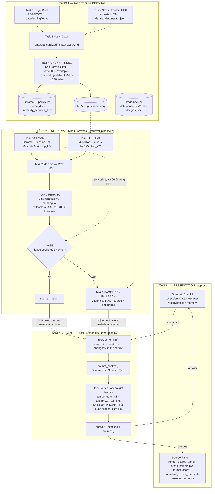
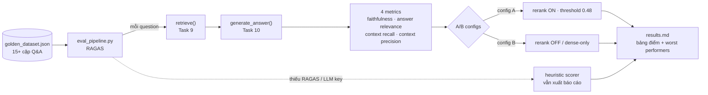

# Bài Tập Nhóm — University Services RAG Chatbot

## Mục Tiêu

Sau khi hoàn thành bài cá nhân, nhóm ngồi lại để xây dựng **1 trong 2 sản phẩm**:

---

## Yêu cầu 1: Sản phẩm nhóm RAG Chatbot

Xây dựng chatbot trả lời câu hỏi về dịch vụ và chính sách đại học liên quan.

**Yêu cầu:**

- Giao diện chat (Streamlit / Gradio / Chainlit)
- Trả lời có citation (dựa trên Task 10)
- Hỗ trợ follow-up questions (conversation memory)
- Hiển thị source documents đã dùng

**Stack gợi ý:**

```
Chainlit/Streamlit → Retrieval (Task 9) → Generation (Task 10) → Display
```

---

## Yêu cầu 2: RAG Evaluation Pipeline

Sử dụng **1 trong 3 framework** sau để evaluate pipeline RAG của nhóm:

### Framework lựa chọn

| Framework                                           | Cài đặt               | Đặc điểm                                      |
| --------------------------------------------------- | ------------------------ | ------------------------------------------------- |
| [DeepEval](https://github.com/confident-ai/deepeval) | `pip install deepeval` | Nhiều metric built-in, dễ integrate với pytest |
| [RAGAS](https://github.com/explodinggradients/ragas) | `pip install ragas`    | Chuẩn industry cho RAG eval, 3 trục chính      |
| [TruLens](https://github.com/truera/trulens)         | `pip install trulens`  | Dashboard UI, feedback functions mạnh            |

### Yêu cầu Evaluation

1. **Tạo Golden Dataset** — tối thiểu 15 cặp Q&A (question, expected_answer, expected_context)
2. **Chạy evaluation** trên toàn bộ golden dataset với các metrics sau:
   - **Faithfulness** — câu trả lời có bám đúng context không?
   - **Answer Relevance** — câu trả lời có đúng câu hỏi không?
   - **Context Recall** — retriever có lấy đủ evidence không?
   - **Context Precision** — trong context lấy về, bao nhiêu % thực sự hữu ích?
3. **So sánh A/B** — chạy eval trên ít nhất 2 config khác nhau (ví dụ: có reranking vs không reranking, hoặc hybrid vs dense-only)
4. **Báo cáo** — bảng điểm + phân tích worst performers + đề xuất cải tiến

Xem code mẫu (DeepEval/RAGAS/TruLens) chi tiết trong `README.md` gốc mục "Yêu cầu 2".

### Deliverable Evaluation

- [ ] File `group_project/evaluation/golden_dataset.json` — 15+ cặp Q&A
- [ ] File `group_project/evaluation/eval_pipeline.py` — script chạy evaluation
- [ ] File `group_project/evaluation/results.md` — bảng điểm + phân tích
- [ ] So sánh A/B ít nhất 2 configs

---

## Yêu Cầu Chung

1. **Tích hợp pipeline** từ bài cá nhân của các thành viên
2. **Demo hoạt động được** trong buổi trình bày (chạy local hoặc deploy)
3. **Evaluation pipeline** chạy được và có báo cáo kết quả
4. **Code push lên repository** chung của nhóm
5. **README** mô tả kiến trúc và phân công (điền bên dưới)

---

## Kiến Trúc Hệ Thống

### Tổng quan 4 tầng



### Evaluation pipeline (offline)



### Bảng thành phần

| Tầng | Module | Công nghệ | Cấu hình chính |
| ---- | ------ | --------- | -------------- |
| Ingestion | `task1_collect_legal_docs.py` | urllib | PDF/DOCX từ trang công khai → `data/landing/legal/` |
| Ingestion | `task2_crawl_news.py` | requests + BeautifulSoup | 5 bài HUST → JSON có metadata |
| Ingestion | `task3_convert_markdown.py` | MarkItDown `[pdf]` | landing → `data/standardized/` giữ cấu trúc |
| Indexing | `task4_chunking_indexing.py` | LangChain splitter + SentenceTransformer | `chunk=500`, `overlap=50`, `all-MiniLM-L6-v2` 384-dim |
| Store | — | ChromaDB PersistentClient | `chroma_db/`, collection `university_services_docs` |
| Retrieval | `task5_semantic_search.py` | ChromaDB query | `score = 1 - distance`, clamp `[0,1]` |
| Retrieval | `task6_lexical_search.py` | `rank-bm25` (fallback pure-Python) | BM25Okapi `k1=1.5`, `b=0.75` |
| Retrieval | `task7_reranking.py` | Jina Reranker API / RRF / MMR | RRF `k=60`, timeout 5s, auto-fallback |
| Retrieval | `task8_pageindex_vectorless.py` | PageIndex.ai API | Vectorless, chỉ chạy khi gate mở |
| Orchestration | `task9_retrieval_pipeline.py` | — | `SCORE_THRESHOLD=0.48`, `top_k=5`, `RERANK_METHOD=rrf` |
| Generation | `task10_generation.py` | OpenRouter (OpenAI SDK) | `gpt-4o-mini`, `T=0.3`, `top_p=0.9`, citation bắt buộc |
| UI | `app.py` + `src/ui_helpers.py` | Streamlit | chat history qua `st.session_state.messages` |
| Eval | `group_project/evaluation/` | RAGAS | 4 metrics, A/B configs, fallback heuristic |

### Quyết định thiết kế đáng chú ý

1. **Gate fallback dùng cosine gốc, không dùng RRF.** Điểm RRF sau khi fuse chỉ phụ thuộc *thứ hạng*, top-1 luôn ≈ `1/(60+1)` ≈ `0.0164` bất kể query có liên quan hay không. Nếu so threshold với điểm RRF thì fallback PageIndex không bao giờ trigger. Pipeline giữ riêng `dense_results[0]["score"]` (cosine trước fuse) làm căn cứ quyết định.

2. **Mọi dependency ngoài đều có fallback.** Jina reranker 403 → RRF. `rank-bm25` thiếu → BM25Okapi pure-Python. PageIndex lỗi → trả kết quả hybrid. RAGAS/LLM key thiếu → heuristic scorer. Demo không chết vì một API rớt.

3. **Reorder chống "lost in the middle".** Chunk tốt nhất đặt đầu, tốt nhì đặt cuối, kém nhất dồn vào giữa — nơi LLM chú ý yếu nhất.

4. **Hybrid mặc định, không dense-only.** Truy vấn quy chế đại học có nhiều mã số/thuật ngữ chính xác ("Điều 12", "GPA 2.0") — BM25 bắt tốt hơn embedding; ngược lại câu hỏi diễn giải cần dense. RRF hợp nhất hai thang điểm không cùng đơn vị.

---

## Phân Công Công Việc

| Thành viên           | MSSV        | Nhiệm vụ              | Trạng thái |
| ---------------------- | ----------- | ----------------------- | ------------ |
| Nguyễn Quang Huy      | 2A202601954 | Team Leader & Architect | ✅ Hoàn thành |
| Trần Nguyễn Anh Minh | 2A202601475 | Data Scraper Dev        | ✅ Hoàn thành |
| Nguyễn Hữu Hiếu     | 2A202601429 | Vector Search Dev       | ✅ Hoàn thành |
| Hoàng Danh Thái      | 2A202601527 | Sparse Search Dev       | ✅ Hoàn thành |
| Trần Quang Trọng     | 2A202601461 | Frontend UI Dev         | ✅ Hoàn thành |
| Nguyễn Hữu Thắng    | 2A202601435 | Benchmark QA Dev        | ✅ Hoàn thành |

---

## Hướng Dẫn Chạy

```bash
git clone https://github.com/33-bit/K3-Day08-RAG-Pipeline.git
cd K3-Day08-RAG-Pipeline
python3 -m venv .venv
source .venv/bin/activate
python -m pip install -r requirements.txt
python -m streamlit run app.py
```

---

## Lưu ý

Hãy giữ lại repo này nếu như bạn học track 3 giai đoạn 2, chúng ta sẽ phát triển tiếp dự án lên knowledge graph để khắc phục các câu hỏi hóc búa khi có các câu hỏi khó.
