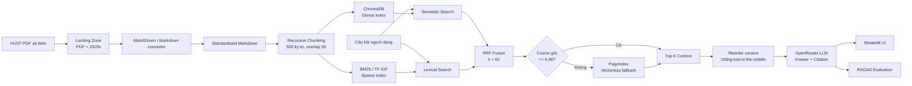

# BÁO CÁO ĐỒ ÁN NHÓM — RAG PIPELINE V2

## 1. Thông tin chung

**Tên đề tài:** Xây dựng hệ thống hỏi đáp quy định và dịch vụ Đại học Bách khoa Hà Nội bằng RAG Pipeline v2  
**Quy mô nhóm:** 6 thành viên  
**Phạm vi:** Thu thập dữ liệu → chuẩn hóa → chunking/indexing → hybrid retrieval → reranking → PageIndex fallback → sinh câu trả lời có nguồn → đánh giá RAGAS.

### Thành viên và phân công

| Role | Thành viên | MSSV | Vai trò chính | Deliverable |
|---:|---|---|---|---|
| 1 | Nguyễn Quang Huy | 2A202601954 | Team Leader & Architect | Kiến trúc tổng thể, tích hợp, Git, điều phối demo |
| 2 | Trần Nguyễn Anh Minh | 2A202601475 | Data Scraper Dev | Thu thập PDF, crawl tin tức, chuẩn hóa Markdown |
| 3 | Nguyễn Hữu Hiếu | 2A202601429 | Vector Search Dev | Chunking, ChromaDB, embedding và semantic search |
| 4 | Hoàng Danh Thái | 2A202601527 | Sparse Search Dev | BM25/TF-IDF, RRF và PageIndex fallback |
| 5 | Trần Quang Trọng | 2A202601461 | Frontend UI Dev | Streamlit chatbot, debugger, nguồn tham khảo |
| 6 | Nguyễn Hữu Thắng | 2A202601435 | Benchmark QA Dev | Golden Dataset 20 câu, RAGAS và báo cáo chất lượng |

> README gốc có một số nội dung RMIT mang tính ví dụ. Bộ dữ liệu và ứng dụng hiện tại của nhóm sử dụng nguồn công khai từ **Đại học Bách khoa Hà Nội (HUST)**.

---

## 2. Mục tiêu và kết quả đạt được

Nhóm xây dựng một pipeline RAG có khả năng trả lời câu hỏi về quy chế đào tạo, tín chỉ, học phí, tốt nghiệp, đào tạo thạc sĩ/tiến sĩ và liêm chính học thuật. Hệ thống kết hợp tìm kiếm dense và sparse, dùng RRF để hợp nhất thứ hạng, có PageIndex làm phương án truy xuất theo cấu trúc tài liệu và hiển thị kết quả qua Streamlit.

Các đầu ra chính:

- 5 văn bản quy định/chính sách HUST dạng PDF và 5 bài viết/thông báo dạng JSON.
- 10 tài liệu Markdown đã chuẩn hóa trong `data/standardized/`.
- Pipeline Task 1–10 trong `src/`.
- Streamlit chatbot tại `app.py`.
- Golden Dataset gồm 20 cặp Q&A có expected answer và expected context.
- RAGAS benchmark đủ 4 chỉ số trên toàn bộ 20 câu.
- Benchmark latency riêng cho RRF và PageIndex.

---

## 3. Kiến trúc hệ thống



### Luồng xử lý

1. Tài liệu được thu thập từ các URL công khai của HUST và lưu nguyên bản tại `data/landing/`.
2. PDF/JSON được chuẩn hóa thành Markdown, giữ metadata nguồn.
3. Nội dung được chia bằng `RecursiveCharacterTextSplitter`.
4. Dense retrieval truy vấn ChromaDB bằng cosine similarity; sparse retrieval dùng BM25.
5. RRF hợp nhất thứ hạng mà không cộng trực tiếp cosine score với BM25 score.
6. Điều kiện fallback dùng **cosine score gốc**, không dùng RRF score. Nếu score nhỏ hơn `0.48`, pipeline thử PageIndex.
7. Context được sắp xếp lại trước khi gửi LLM, sau đó câu trả lời và nguồn được hiển thị trên UI.

---

## 4. Báo cáo theo từng role

### Role 1 — Team Leader & Architect

Role 1 chịu trách nhiệm ghép các module Task 1–10 thành pipeline thống nhất và kiểm soát giao diện dữ liệu giữa các tầng. Mỗi kết quả retrieval dùng schema chung gồm `content`, `score`, `metadata` và `source`. Kiến trúc tách ingestion, retrieval, generation và evaluation giúp từng role phát triển độc lập trước khi tích hợp.

Các quyết định kiến trúc quan trọng:

- Duy trì metadata nguồn xuyên suốt từ landing đến citation.
- Dùng hybrid retrieval để bù trừ hạn chế giữa semantic match và exact keyword match.
- Dùng RRF vì cosine `[0,1]` và BM25 `[0,+∞)` không thể cộng trực tiếp.
- Dùng cosine gốc làm tín hiệu fallback do RRF top score luôn quanh `1/(60+1)` cho một ranker.
- Tách báo cáo chi tiết RAGAS khỏi báo cáo tổng hợp nhóm.

### Role 2 — Data Scraper Dev

Nhóm thu thập 5 tài liệu pháp quy từ HUST:

1. Quy chế tổ chức và quản lý đào tạo 2024.
2. Quy chế đào tạo 2025.
3. Quy định học bổng nghiên cứu sinh 2026.
4. Quy chế đào tạo theo tín chỉ.
5. Quy định liêm chính học thuật 2025.

Ngoài ra, 5 bài viết/thông báo được crawl từ website HUST và lưu dạng JSON kèm URL, tiêu đề, thời điểm crawl và nội dung. Task 3 chuyển dữ liệu sang Markdown để các tầng chunking và retrieval dùng chung một định dạng.

**Kết quả:** vượt yêu cầu tối thiểu 3 tài liệu pháp lý và 5 bài viết; dữ liệu landing và standardized đều tồn tại, có nội dung và metadata.

### Role 3 — Vector Search Dev

Cấu hình thực tế trong code:

| Thành phần | Cấu hình |
|---|---|
| Chunking | `RecursiveCharacterTextSplitter` |
| Chunk size | 500 ký tự |
| Chunk overlap | 50 ký tự (10%) |
| Embedding model | `all-MiniLM-L6-v2` |
| Embedding dimension | 384 |
| Vector store | ChromaDB persistent |
| Distance | Cosine |
| Collection | `university_services_docs` |

`all-MiniLM-L6-v2` được chọn vì nhẹ và phù hợp demo local. Tuy nhiên, đây không phải cấu hình BGE-M3 1024 chiều nêu trong slide phân vai. Nếu thuyết trình về **code hiện tại**, nhóm phải trình bày MiniLM 384 chiều; BGE-M3 nên được nêu là hướng nâng cấp để cải thiện truy vấn tiếng Việt và đa ngôn ngữ.

Semantic search trả kết quả giảm dần theo similarity và có hàm HyDE để mở rộng truy vấn. ChromaDB giúp lưu documents, embeddings và metadata bền vững giữa các phiên chạy.

### Role 4 — Sparse Search Dev

Sparse retrieval sử dụng BM25 Okapi với:

- `k1 = 1.5`: kiểm soát term saturation; từ khóa lặp lại nhiều lần vẫn tăng điểm nhưng mức tăng giảm dần.
- `b = 0.75`: chuẩn hóa độ dài tài liệu để đoạn dài không được ưu tiên chỉ vì chứa nhiều từ.
- TF-IDF + cosine similarity được triển khai như phương án so sánh/bonus.

RRF áp dụng công thức:

\[
RRF(d)=\sum_r \frac{1}{k+rank_r(d)}, \quad k=60
\]

RRF chỉ dùng thứ hạng nên cân bằng được dense và sparse retrieval dù hai nguồn có thang điểm khác nhau. PageIndex đóng vai trò vectorless fallback cho tài liệu dài hoặc truy vấn cần hiểu cấu trúc mục/chương. API PageIndex được xử lý theo cơ chế submit query, polling retrieval và chuẩn hóa kết quả về schema chung.

Benchmark latency thực tế:

| Phương pháp | Latency đo được | Nhận xét |
|---|---:|---|
| RRF fusion | 0.04 ms trung bình | Tính toán hoàn toàn trong bộ nhớ trên hai ranked lists giả lập |
| PageIndex | 17,346.67 ms (~17.35 s) | Bao gồm gọi mạng, xử lý cloud và polling; 4 kết quả |

Mốc PageIndex cao hơn kỳ vọng 2–5 giây do phụ thuộc mạng, hàng đợi API và chu kỳ polling 3 giây. Tài khoản thử nghiệm cũng gặp giới hạn credit, vì vậy nhóm chỉ ghi nhận một lượt PageIndex thành công.

### Role 5 — Frontend UI Dev

Ứng dụng Streamlit cung cấp:

- Giao diện chat và lịch sử hội thoại qua `st.session_state`.
- Slider Top-K, ngưỡng fallback cosine và toggle RRF.
- Badge phân biệt `Hybrid Retrieval (RRF)` và `PageIndex Fallback`.
- Hiển thị nguồn, điểm retrieval và đoạn trích dẫn.
- Pipeline Debugger so sánh trực tiếp Semantic Search và BM25.
- Tab hướng dẫn kiến trúc và cấu hình hệ thống.
- Demo fallback khi backend/API không sẵn sàng để UI không bị gián đoạn hoàn toàn.

Generation sử dụng OpenRouter, temperature thấp (`0.3`) để ưu tiên tính xác thực, `top_p=0.9`, Top-K mặc định bằng 5. Context được reorder theo chiến lược `front + back[::-1]` nhằm giảm hiện tượng *lost in the middle*. Prompt yêu cầu chỉ dùng context và trả lời không thể xác minh khi thiếu bằng chứng.

### Role 6 — Benchmark QA Dev

Golden Dataset gồm 20 câu tiếng Việt, bao phủ:

- Tín chỉ, học phần, thang điểm và học cải thiện.
- Hoãn thi, phúc tra, học phí.
- Tốt nghiệp đại học và chuyển chương trình.
- Cảnh báo học tập.
- Đào tạo thạc sĩ và tiến sĩ.
- Liêm chính học thuật.

RAGAS 0.1.21 được chạy trên toàn bộ 20 câu với `openai/gpt-4o-mini` qua OpenRouter làm LLM judge. Mỗi câu được chấm bốn metric, tổng cộng hoàn tất **80/80 lượt đánh giá** và không có giá trị thiếu/NaN.

| Metric | Ý nghĩa | Điểm |
|---|---|---:|
| Faithfulness | Câu trả lời có được context hỗ trợ hay không | 0.8667 |
| Answer Relevance | Câu trả lời có trực tiếp giải quyết câu hỏi hay không | 0.1045 |
| Context Recall | Retriever lấy được bao nhiêu evidence cần thiết | 0.8833 |
| Context Precision | Context được lấy về có tập trung vào nội dung hữu ích không | 0.9790 |
| **Trung bình** | Trung bình bốn metric | **0.7084** |

**Diễn giải:** Context Precision và Context Recall cao cho thấy BM25 tìm được bằng chứng khá đầy đủ và ít nhiễu. Faithfulness 0.8667 cho thấy phần lớn câu trả lời bám nguồn. Answer Relevance thấp là điểm yếu chính; nguyên nhân có thể đến từ câu trả lời dài/chưa trực tiếp và việc benchmark dùng local hash embeddings cho phép đo similarity thay vì embedding semantic chuyên dụng. Vì vậy không nên diễn giải 0.1045 như kết luận duy nhất rằng câu trả lời hoàn toàn sai.

Ba trường hợp yếu nhất:

1. Câu hỏi thời gian và số tín chỉ chương trình cử nhân: Faithfulness, Relevance và Recall bằng 0.
2. Giới hạn tín chỉ của học viên thạc sĩ: Recall 0.5, Faithfulness 0.6667.
3. Phân biệt học phần tiên quyết/học trước/song hành: Faithfulness 0.3333 dù Recall và Precision đạt 1.0.

Chi tiết từng câu nằm trong `evaluation/ragas_results.json`; báo cáo chuyên sâu nằm tại `evaluation/results.md`.

---

## 5. Kiểm thử và tiêu chí hoàn thành

Nhóm sử dụng `tests/test_individual.py` để kiểm tra Task 1–10. Trong quá trình tích hợp, nhóm từng ghi nhận mốc:

```text
35 passed in 17.32s
```


Các nhóm test bao phủ sự tồn tại và nội dung dữ liệu, chunk size, schema kết quả search, thứ tự score, Top-K, RRF, PageIndex adapter, fallback pipeline, citation formatting và document reordering.

Lệnh tái kiểm tra trước demo:

```powershell
.\.venv\Scripts\python.exe -m pytest tests/test_individual.py -v
```

---

## 6. Hạn chế và rủi ro

1. **Sai khác tài liệu hướng dẫn và code:** README/slide có nhắc BGE-M3 1024 chiều và chunk 800/100, trong khi code hiện dùng MiniLM 384 chiều và chunk 500/50.
2. **Answer Relevance thấp:** cần chạy lại với embedding semantic đa ngôn ngữ để có phép đo đáng tin cậy hơn.
3. **Chưa có A/B RAGAS hoàn chỉnh:** báo cáo hiện ghi nhận một cấu hình BM25 Top-K=5; yêu cầu so sánh hybrid+rereank với dense-only vẫn là phần cần bổ sung nếu chấm theo rubric đầy đủ.
4. **PageIndex phụ thuộc dịch vụ ngoài:** latency biến động và credit giới hạn; fallback phải xử lý lỗi mềm.
5. **Dữ liệu tin tức có HTML thừa:** cần làm sạch boilerplate tốt hơn để tránh ảnh hưởng retrieval.
6. **Model MiniLM không tối ưu tiếng Việt:** BGE-M3 hoặc embedding đa ngôn ngữ là hướng nâng cấp hợp lý.

---

## 7. Kết luận hiệu quả RAG Pipeline v2

Pipeline v2 đã hoàn thành luồng end-to-end từ dữ liệu thật đến giao diện và đánh giá tự động. Điểm mạnh nổi bật là khả năng lấy context đúng và tập trung, thể hiện qua Context Recall `0.8833` và Context Precision `0.9790`. Việc kết hợp dense/sparse retrieval với RRF giúp kiến trúc linh hoạt hơn một retriever đơn lẻ; PageIndex bổ sung đường fallback cho truy vấn cấu trúc dài.

Tuy nhiên, chất lượng retrieval cao chưa tự động đảm bảo câu trả lời tối ưu. Answer Relevance thấp cho thấy nhóm cần tiếp tục tối ưu prompt, độ ngắn gọn của answer, embedding tiếng Việt và phương pháp đánh giá. Vì vậy kết luận phù hợp là: **Pipeline v2 hoạt động tốt ở tầng truy xuất và grounding, nhưng tầng generation/evaluation similarity còn cần hiệu chỉnh trước khi dùng trong môi trường production.**

---

## 8. Bài học kinh nghiệm của nhóm

- Schema và metadata chung cần được thống nhất từ đầu để ghép module nhanh.
- Không so threshold fallback với RRF score; phải giữ cosine score gốc.
- Phải tách thời gian upload/index khỏi latency truy vấn khi benchmark.
- API cloud cần retry, timeout, graceful fallback và kiểm soát quota.
- Golden Dataset phải bám đúng corpus; dữ liệu mẫu RMIT không phù hợp corpus HUST.
- Báo cáo phải phản ánh code thực tế, không sao chép cấu hình gợi ý từ đề bài.
- Một metric thấp cần được phân tích cùng cách cấu hình metric; không nên chỉ nhìn điểm tổng.
- Automated tests là checkpoint quan trọng trước khi tích hợp UI và chạy evaluation tốn phí.

---

## 9. Kịch bản demo đề xuất

1. Role 1 trình bày kiến trúc và luồng dữ liệu end-to-end.
2. Role 2 mở một PDF gốc, JSON crawl và Markdown tương ứng để chứng minh provenance.
3. Role 3 demo một truy vấn semantic và giải thích vector, cosine, ChromaDB.
4. Role 4 so sánh BM25 với dense search, giải thích RRF và benchmark PageIndex.
5. Role 5 chạy Streamlit, hỏi một câu trong domain và mở Pipeline Debugger.
6. Role 6 trình bày bốn điểm RAGAS, bottom-3, hạn chế và kế hoạch cải tiến.

### Lệnh chạy

```powershell
# Kiểm thử
.\.venv\Scripts\python.exe -m pytest tests/test_individual.py -v

# Chạy ứng dụng
.\.venv\Scripts\streamlit.exe run app.py

# Chạy lại RAGAS (tốn OpenRouter quota)
.\.venv\Scripts\python.exe -m group_project.evaluation.eval_pipeline
```

---

## 10. Tài liệu tham khảo

- README và LAB_GUIDE của dự án.
- Tài liệu công khai từ Đại học Bách khoa Hà Nội được lưu URL trong Task 1–2.
- ChromaDB, Sentence Transformers, rank-bm25, PageIndex, RAGAS và Streamlit.
- Cormack et al. (2009), Reciprocal Rank Fusion.
- Liu et al. (2023), *Lost in the Middle: How Language Models Use Long Contexts*.
